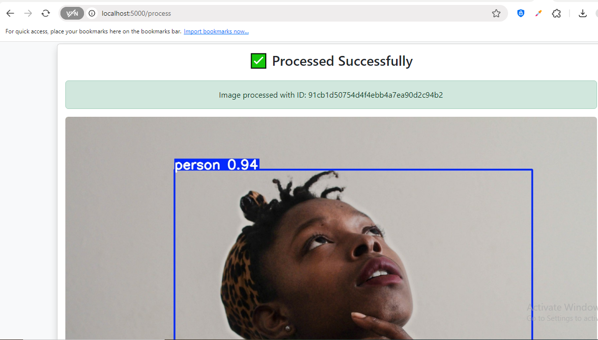

## Flask-Powered Object Detection: Integrating YOLOv3 and YOLO12 for Real-Time Analysis

**Computer vision** is revolutionizing industries, from autonomous driving to real-time surveillance and healthcare diagnostics. One of the most powerful techniques in this field is the **YOLO (You Only Look Once)** - a state-of-the-art computer vision framework, known for its speed and accuracy in detecting multiple objects in a single image.

This article guides you through the process of building a Flask-based real-time object detection using both YOLOv3 and YOLOv12. By implementing both versions, you'll gain a broader understanding of the YOLO framework, thereby allowing you to compare performance, accuracy, and efficiency across different YOLO architectures.

The result is a functional Flask Application that not only serves a single YOLO-based object detection, but also allows multiple image uploads, process them in parallel, and download the results as a ZIP file.
 

📖 **Read the full article**: [Click here](https://dev.to/doyinelugbadebo/flask-powered-object-detection-integrating-yolov3-and-yolo12-for-real-time-analysis-2fd8)  


## 🛠️ How to Use  

1️⃣ **Clone the repository:**  

 ```sh
   git clone https://github.com/DoyinHubX/flaskObjectDetectionAPP_with_YOLOv3_and_YOLO11.git
 ```

2️⃣ Navigate into the project folder:

 ```sh
   cd flaskObjectDetectionAPP_with_YOLOv3_and_YOLO11
 ```

3️⃣ Install dependencies:

 ```sh
  pip install -r requirements.txt
 ```

5️⃣ Start the development server:

 ```sh
  python app.py
 ```
 
6️⃣ Access the app in your browser at: http://127.0.0.1:5000/


## 📷 Screenshot  

